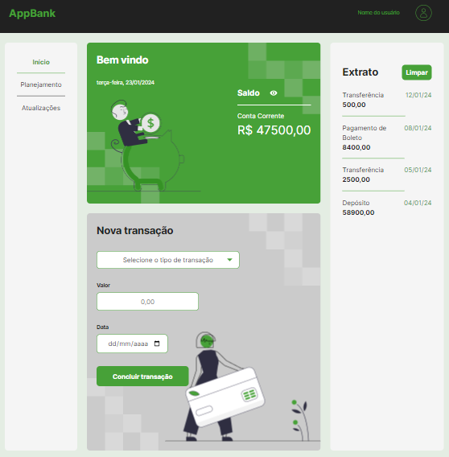

# App Bank
Domine suas finanças com facilidade: o __AppBank__ permite que você registre transações detalhadas e planeje suas despesas com listas personalizadas, proporcionando controle total sobre seu dinheiro e tranquilidade financeira.

## Índice
- <a href="#abrir-projeto">Abrir Projeto</a>
- <a href="#design-do-projeto">Design do Projeto</a>
- <a href="#tecnologias-utilizadas">Tecnologias Utilizadas</a>
- <a href="#autor">Autor</a>

## Abrir Projeto
[Link demonstração](https://financial-control-bank-app.netlify.app/)  
Clique no link acima para acessar a aplicação

## Design do Projeto
### Visualização em telas pequenas &#8595;

## Visualização em telas grandes &#8595;

## Tecnologias Utilizadas
React, TypeScript, StyledComponents, Vite e Git  

## Autor
Olá meu nome é Pedro Matos.  
Sou apaixonado pelo ambiente de tecnologia. Adoro acompanhar o contexto tecnológico como um todo, tendências e lançamentos globais sobre programas, softwares, aparelhos, jogos, IA, etc. E venho estudando constantemente sobre programação.  

Entre em contato comigo:  

<a href="https://www.linkedin.com/in/pedro-matos-dev/" target="_blank" rel="noopener noreferrer">LinkedIn</a> 
